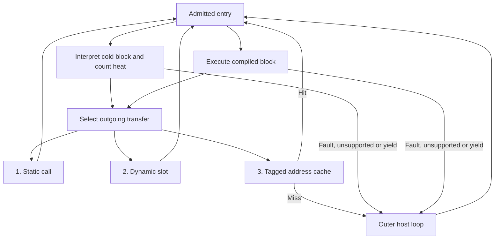

# Runtime orchestrator design

Status: proposed architecture; the runtime and APIs described below are not
implemented. The existing [host ABI](../crates/x86/docs/host-integration.md) remains
the contract for today's generated entries.

Execution starts in the generated interpreter. Only observed hot blocks become
snapshot-compiled Wasm. Transfers prefer **static links, then dynamic links, then
address lookup**. Interpreter and compiled execution share instruction semantics,
CPU backing, guest memory and fault behavior. There is one compilation tier;
grouping already-hot blocks improves linkage without requiring trace compilation
or compiling cold successors.

## Existing foundation

[`Compiler`](../crates/x86/src/compile.rs) generates snapshot blocks and runtime
decoding under one `ExecutionProfile`. Both frontends use
[`ExecutionBuilder`](../crates/x86/src/execution.rs) for instruction effects,
retirement, precise faults and state publication. Snapshot specialization already
restarts the current instruction through `wasm86.interpret` before its effects.

The current entries publish state and tail-call `dispatch(next_eip)`. That ABI
does not identify the source edge. Conditional execution has already selected a
destination value by this point, so replacing the host callback alone cannot
produce two statically linked branch arms. There is also no runtime cache,
hotness policy, snapshot dependency metadata, write barrier or execution budget.
The generic compiler supports direct tail calls, including imported Wasm
functions, but not function tables or indirect tail calls.

The orchestrator needs extensions to these owners, not another instruction
decoder or an interpreter implemented in the embedding language.

## Ownership and execution path

A new `wasm86-runtime` crate should own cache identity, admission, compilation
scheduling, installation, invalidation and eviction. Its generated Wasm helpers
own frequent dispatch and cold-block counters. An engine adapter creates memories,
instances and function tables and services uncommon exits. Keep Wasmtime and V8
adapters thin; introduce a shared engine interface only around operations both
actually require.

| Owner | Responsibility |
| --- | --- |
| `wasm86-runtime` | Block records, execution contexts, links, run limits, code dependencies and compilation lifecycle. |
| `wasm86-x86` decoding/compilation | Checked snapshot planning, instruction boundaries, outgoing edges and generation of one or several block functions. |
| `wasm86-x86` execution/state | Retirement, precise restart, publication and instruction/REP checkpoints. |
| `wasm86-x86` memory | Write observation after guest access checks, including aliases, atomics and bulk transfers. |
| `wasm86-compiler` | Typed table imports and indirect tail calls, alongside existing direct calls. |
| Embedding | Devices, memory-map policy, execution mode and servicing runtime stops. |

Successful block transfers stay inside Wasm. Do not recursively call a Wasm
export from a JavaScript or Rust dispatch callback: tail-calling that callback
does not remove the new host-to-Wasm activation it creates. A slow-path request
returns to one outer host loop, which services it and enters Wasm again. This
keeps long chains and guest recursion independent of the native call stack.



Keep CPU publication at block boundaries for the initial runtime. Direct links
remove dispatch overhead without introducing another cross-block register or
flag ABI. Avoiding publication across a region is a separate optimization that
requires measurements and precise side-exit reconstruction.

## Identity and compact runtime storage

An EIP alone is not an execution identity. It is relative to CS; equal EIPs can
name different bytes, execution modes or address spaces. Use these proposed
logical types, with private storage layouts owned by the runtime:

```rust,ignore
struct BlockKey {
    context: ContextId,
    eip: u32,
}

struct EntryId(NonZeroU32);

struct CodeVersion {
    entry: EntryId,
    generation: u64,
}
```

`ContextId` identifies an address-space identity, the complete `ExecutionProfile`
and a validated CS fetch view: base, limit and relevant attributes. It also records
the profile admission under the loaded segment caches. Incompatible segment
changes require a new context admission. Runtime segment inputs that do not
break admission remain dynamic; descriptor-table edits alone do not change
already-loaded caches. Mode selection is explicit, never inferred from segments.

Code bytes and mapping revisions are version dependencies, not fresh cache keys
on every write. Track both fetched linear/physical pages and their backing pages:
two mappings can alias one backing page. A byte write invalidates all dependent
aliases; a remap invalidates the entries using that mapping. Guarded CPU
observations, such as x87 modes, remain instruction-local specialization inputs
rather than expanding `BlockKey` with every observed CPU value.

`EntryId` indexes both a dense record in runtime control memory and its stable
Wasm table slot. Coallocate them so a lookup returns one 32-bit handle, with no
second mapping from record to slot. Zero is reserved for unresolved destinations;
a successful lookup never calls slot zero. A record holds its key, generation,
execution state, saturating heat counter and pending-compilation flag. Larger
dependency lists, reverse links and compiler artifacts stay in host-owned storage.
Generated code embeds record offsets and IDs where known. Keep control metadata
out of `cpuState`, `machine` and `physicalMap`; those memories have existing
independent ABIs.

Each admitted context owns a dispatch namespace. Bind its lookup storage on
admission and retain that binding across transfers that preserve the context.
Segment/environment changes take `Reenter` before using another link. This lets
inner lookup compare only EIP; context identity follows from the namespace rather
than a repeated `ContextId` load and comparison. A cold edge is likewise owned by
its source record and context. This is an identity proof, not a code-validity proof:
target gates and compiled-unit validity rules still apply.

Use a bounded cache of packed `{ eip: u32, entry: u32 }` records for general
computed destinations. One `i64.load` obtains both the full address tag and
`EntryId`. Accept a hit only if the tag equals the actual EIP and the handle is
nonzero, including when EIP itself is zero. Collisions are misses, never evidence
of identity. On a miss, return a resolver request; the host's complete
`(ContextId, EIP)` map finds or creates the record and fills the cache. Choose the
index function and capacity from address distributions; x86 entries need not be
aligned, so dropping low bits must never establish identity.

An exact page/byte-offset index is an optional alternative for dense hot address
sets: `leaf = root[eip >> 12]`, then `entry = leaf[eip & 4095]`. A shared zero leaf
represents untouched pages without a separate page-presence branch. Every byte
offset needs its own slot. With 32-bit pointers/IDs, the root costs 4 MiB per
context and each populated 4 KiB guest page needs a 16 KiB leaf. It removes hashing
and tags but retains two dependent loads, consumes more cache/TLB capacity, and
still needs entry transfer and validity checks. Keep the compact cache as the
initial default; require workload evidence before paying for the exact index.
Both representations must fit the runtime's metadata budget.

## Link selection

Apply the following order at each edge; these are transfer mechanisms, not three
execution tiers. A cached destination can still be interpreted.

| Transfer | Generated path | Admission and replacement |
| --- | --- | --- |
| Static, within one compiled unit | `return_call` to a known block function. | Internal body entry is allowed only under the unit's current validity proof. |
| Static, to another installed unit | `return_call` to an imported Wasm entry. | Call its guarded entry; the import is immutable and pins that instance. |
| Predicted computed destination | Compare the actual EIP with a constant, then use a static link. | Same unit/gate rules as other static links; mismatch continues through dynamic resolution. |
| Dynamic, known destination | `return_call_indirect` through a constant entry slot. | Slot points to the currently admitted compiled entry or the shared cold entry. |
| Dynamic, computed destination | Probe one packed record at a fixed per-edge address, then use its `EntryId`. | Compare full target EIP and reject zero; the admitted namespace supplies context identity. |
| Unresolved destination | Context-owned address cache, then the full resolver on a miss. | Establish identity and repair a dynamic edge before continuing. |

An immediately known target should never perform a full address lookup on every
execution. Give each conditional outcome its own link. An uncompiled target uses
a slot pointing to the interpreter; installing its compiled entry updates that
slot without rebuilding its callers. Promote an edge to a static call when its
caller is next compiled or regrouped. Do not rebuild on every new neighbor.

Wasm function bodies and imports cannot be patched in place. Compile connected,
already-hot blocks together to make loops and mutual calls direct inside one
module. Direct imports can bind previously installed targets; newly created
cycles need a common module or dynamic slots. Cap unit size and rebuilding work
so a large control-flow graph cannot make compilation or invalidation unbounded.

An external static link must enter a gate tied to the captured `CodeVersion`,
not an unchecked old body. Replacing its slot cannot redirect that import. A
stale gate resumes through the current record; immutable static callers keep the
old gate and instance alive until those callers are retired. Track this ownership
explicitly. Prefer dynamic links for targets with frequent invalidation or churn.

Gate failures have distinct continuations. A context mismatch resolves the live
context/EIP rather than reusing the captured key. An epoch mismatch requests
validity service before entering another compiled body. A replaced generation
can follow its replacement slot. Never redirect an invalid gate into the same
unchanged slot: that would loop without executing or revalidating guest code.

Indirect branches and near returns start with one packed target record per site.
The probe address is known from the source edge, so a hit needs no hash or page
walk. Sample its success separately from host resolver misses. A small polymorphic
cache is justified only by measured hit rates; highly variable sites bypass the
per-site probe and go directly to general address lookup.

When recompiling or regrouping a hot unit, promote a stable computed target to a
guarded static edge. For example, `if actual_eip == predicted_eip { direct(target) }`
removes the cache load and indirect call on a hit. The false arm resolves the
original actual EIP, and the true arm obeys the same validity and instance-lifetime
rules as every static link. The address comparison alone does not validate code.
Bound the number of predictions and their rebuilding cost; prediction changes
do not justify compiling cold targets. A return prediction must use the
architecturally loaded return address in the admitted context. It must not
replace guest stack reads, checks or faults, or assume that CALL/RET are balanced.

The proposed private table signature is `(entry_id: i32) -> i64`. This lets all
cold slots reference one interpreter adapter rather than generating a Wasm stub
for every cold address. Compiled entries know their own identity; static edges
pass a constant ID. The existing public `() -> i64` entries remain available via
their existing compilation API; orchestrated entries use an explicit new mode.
Every published table slot has the expected function signature and a callable
target. Null slots or type traps are internal bugs, not cache-miss mechanisms.

## Interpretation and hot-block compilation

1. Admit the current context and find the starting block record. Its slot initially
   points to the shared interpreter adapter for that profile.
2. Count entry into a cold block with a saturating counter in Wasm. Continue
   decoding live bytes through a branch, segment load, port I/O or a runtime
   chunk limit. The chunk limit bounds straight-line interpretation and uses the
   same instruction boundary policy as snapshot planning.
3. When heat reaches a configurable threshold, enqueue that code generation once.
   Continue interpreting while the job is pending. If the bounded queue is full,
   defer the job without blocking guest execution or allocating more work.
4. Capture checked code and dependencies at a safe boundary. Compile only the
   requested hot blocks, optionally grouping a bounded connected set. A branch
   destination being adjacent or known does not make it hot.
5. Instantiate without exposing the result, recheck all dependencies and the job
   generation, then publish the ready entries and update slots together while
   guest execution is stopped. A stale result is discarded.

Interpreter instruction dispatch stays inside its existing decoder. Heat is
recorded per runtime block entry, not by a host callback per instruction. The
chunk limit is independent of the heat threshold, code-size limit and run budget.
Choose initial limits as configuration for measurement; no threshold is claimed
optimal without workloads.
Eligibility is level-triggered: heat at or above the threshold remains eligible
when there is no pending job or active refusal. Queue saturation or a retry delay
must not lose the only opportunity to compile a block whose counter has saturated.

The cold adapter records the active `EntryId`; completion retains the terminating
instruction's EIP and edge kind. Cached cold edges compare the newly decoded
target EIP under the source context's namespace before using a slot, even for
immediate branches: the interpreter reads live bytes, so an old edge cannot assume
an unchanged encoding. A context change reenters admission instead. Target-cache
hits repair these links without entering the host.

Compiled blocks normally stop updating their heat counters. Sample edges only
when needed to decide regrouping, eviction or a specialization change. Repeated
specialization failures reduce the preference for that version; interpretation
must attempt the failed instruction before normal compiled dispatch resumes.
Start with one installed compiled version per key and a bounded retry cooldown,
rather than accumulating variants for every observed state.

Unsupported or unavailable snapshot input stays interpreted. Cache compilation
refusals only for the corresponding code generation, so changing code can become
eligible again. Report compiler/engine validation errors as implementation failures;
do not relabel them as guest faults. Compilation is optional for progress, but a
broken compiler must remain diagnosable.

## Snapshot planning and outgoing edges

Add a planning operation to the x86 compiler that consumes checked code from the
runtime memory owner and retains the decoder's instruction boundaries. Its result
must describe exact fetched spans, instruction count, outgoing edges and required
execution assumptions. Keep decoded instructions private and reusable for emission;
the runtime must not decode the same bytes with a second opcode implementation.

Planning may inspect only side-effect-free backing. In protected mode it checks CS
and present mappings; in Real16 it may capture stable RAM/ROM. MMIO instruction
fetches stay interpreted, and speculative planning must never call a device or
read an unneeded byte. Honor instruction-length limits and address wrapping using
the existing decoder and memory rules.

Stop before an unavailable, unsupported or invalid instruction. An already-valid
prefix can be compiled with an interpreter continuation at that instruction.
With an empty prefix, keep interpreting. Planning failures do not deliver guest
faults: the interpreter attempts the instruction and establishes the real fault
and access order. Transfer instructions still commit before destination fetch.

The compiler also needs to preserve control-flow intent until linkage is chosen.
For example, a proposed internal completion description is:

```rust,ignore
enum Transfer {
    Direct { target: Val<I32> },
    Conditional {
        taken: Val<I1>,
        target: Val<I32>,
        fallthrough: Val<I32>,
    },
    Indirect { target: Val<I32> },
    Reenter { target: Val<I32> },
}
```

The condition uses the compiler's logical `I1`, destinations use `I32`, and
snapshot-known targets retain constant expressions. `Reenter` marks a terminal
segment or environment change requiring admission before further linkage.
Instruction semantics still own transfer checks and effects. The frontend lowers
the resulting completion into two branch arms, a direct call, a slot call or an
ordinary host dispatch. Share this mechanism with the existing entry generators;
do not teach the runtime to recognize opcodes or rewrite emitted Wasm.

## Validity during execution

Entry checks alone do not make a snapshot safe. A store in its first instruction
can change a later instruction in the same block. Mapping and device changes
must also be observed before the next affected instruction.

Maintain a code-watch bit per backing page and a monotonically increasing code
epoch in runtime control memory. Watched writes take a slow path that marks the
backing dependency dirty and advances the epoch before exposing changed bytes.
The ordinary store path performs a cheap watch check after the existing segment
and mapping checks; guest permission bits are not repurposed as write traps.
Track mapping changes separately, advancing the same validity epoch when needed.

Register watches and dependency versions during snapshot capture, before guest
execution resumes. Pending jobs and cached compilation refusals need observation
as well as installed units; otherwise a write during the first compilation could
go unnoticed. Retain watches until every dependent job, refusal and unit is gone.
An unobservable code source cannot support a durable negative-cache entry; use
a bounded retry delay instead.

A compiled unit's gate checks its context, installed generation and last validated
epoch. An unchanged epoch allows entry without walking pages or comparing bytes.
On an epoch mismatch, the slow path examines precise dependencies and either
revalidates the unit or invalidates it. This deliberately starts with one global
epoch and precise slow-path dependencies; finer domains should follow evidence
that unrelated writes cause material overhead.

Within a unit, direct body links can reuse a single proof over the union of its
dependencies. They remain legal only while context and code validity are stable.
After an instruction that dirtied watched code or changed relevant routing,
publish its completed effects and leave the compiled body before the next
instruction. Do not finish a captured suffix after self-modification. A failed
instruction keeps its existing partial effects and fault result; any writes it
completed still invalidate dependent code.

The memory owner must cover ordinary stores, scattered stores, locked updates,
stack/x87 stores and bulk copy/fill. A bulk operation may retain its fast path
when its whole destination is unobserved; otherwise use an observed path with
the same permission, overlap and partial-progress behavior. Check backing pages,
not only guest linear addresses. Conservative invalidation of a checked but
unchanged destination is safe; avoiding it is a later measurement question.

Host writes and mapping edits go through the same runtime-owned mutation API.
Port and MMIO adapters use it for device changes, including changes caused by a
read callback. A callback whose mutations cannot be described precisely must
invalidate conservatively. Device transfers retain the existing prohibition on
CPU-state access and guest reentry. The current instruction completes or faults
under its existing semantics, then invalidation prevents another stale fetch.

For the initial implementation, compiled blocks may conservatively end after
every potentially code-writing instruction or callback until the shared barrier
and instruction-boundary exit mechanism are complete. This alone is insufficient:
the write must also invalidate successor entries and aliases. Do not enable
multi-instruction compiled execution over mutable code before both mechanisms
exist.

Generation/epoch wrap requires a quiescent cache reset, never acceptance of an
old proof. One guest CPU owns these private memories; concurrent guest CPUs and
DMA require a different synchronization contract and are outside this design.
Background compilation consumes immutable snapshots only.

## Stopping, restart and host results

The existing `run` and `step` entries are unbudgeted, and REP can take unbounded
time within either. Keep that contract explicit. Add budgeted orchestrated entries
instead of claiming that a snapshot instruction limit makes a runtime responsive.

Use a proposed `RunBudget` with separate limits for retired instructions and REP
elements. Check limits before new work; zero instruction budget executes nothing.
A compiled block can check its known instruction count once on entry. If the
remaining instruction budget is smaller, enter the budgeted interpreter for the
remainder. Every exit charges only the completed prefix, using the execution
owner's count rather than subtracting wrapping `CpuState::instruction_count`
snapshots. Static cycles and dynamic links both pass these budget checks.
The short-budget path must execute interpreted work before reconsidering that
compiled entry, just as the forced-interpreter path below must make progress.

Interpreter checkpoints occur between instructions. REP also needs element or
bounded-chunk checkpoints shared by both frontends. Yielded REP keeps the original
instruction EIP, completed indices/count, permitted partial effects and no
retirement until the repetition ends. Check the repeat termination condition
before deciding to yield, so the final element retires exactly once.
Bound the range preflight and bulk copy/fill to the admitted chunk before resolving
operands; checkpoints around a scalar loop do not bound today's whole-count
preflight and native bulk paths. Preserve per-element fault order when a chunk
cannot use the direct path.

Resuming REP may require a runtime continuation holding its decoded operation,
prefixes and entry flags. In particular, CMPS/SCAS fault behavior must retain
entry flags, and a yield must not accidentally decode different bytes after the
instruction wrote its own code. Own that continuation with string execution;
either frontend resumes the same operation. Define paused-state edits explicitly:
memory edits can invalidate future code, while replacing CPU state cancels the
suspended operation as an explicit execution reset. A simple EIP rewind is not
a complete resumable-REP design.
Changing execution mode is rejected while an instruction is suspended: first
finish it or explicitly reset execution. A reset does not roll back completed
memory/device effects. This prevents a decoded Real16 port repetition, for
example, from silently resuming under a protected-mode profile.

Retain semantic progress only across a yield. Discard physical addresses, page
caches and resolved range/access proofs, then check the live mappings and segment
state again on resume. A paused remap or permission change must affect the next
element; reusing the previous invocation's `physical_start` would be incorrect.

Budget exhaustion is a host yield, not a guest exception or interrupt delivery.
The limits bound guest work, not wall-clock time in synchronous device callbacks
or host compilation. Interrupt injection, STI/SS inhibition and halt handling
must follow their own architectural contracts as those features are added.

Preserve today's guest-fault/unsupported `i64` encoding. Runtime-control exits use
a separate typed stop record in runtime control memory, cleared before entry;
on a control exit its discriminant tells the outer loop to consume that record
rather than decode the returned `i64` as a guest fault. It identifies yield,
resolution, compilation service or invalidation service and carries the relevant
IDs. This avoids guessing a new tag from today's opaque dispatch return value.
All such exits publish the required CPU boundary before returning.

Specialization failure uses a distinct forced-interpreter path. It abandons the
compiled suffix, attempts the current instruction, and only then permits normal
dispatch. A yield before that attempt preserves the forced-interpreter state
across host calls. It must not repeatedly select the same failing compiled entry.

## Publication and cache lifetime

Separate the record's execution choice (interpreted or compiled) from an optional
pending job. Each job captures the block generation, context, bytes, dependency
versions and any guarded CPU observations. Host or guest changes can cancel that
generation while the interpreter continues. No partially compiled entry becomes
visible through a table slot or static import.

At a safe boundary: validate the finished job, install its metadata and guarded
exports, then publish table slots. Reverse dependencies connect backing/mapping
pages to compiled units and static imports to the instances they retain. Epoch
changes make old gates fail immediately; invalidation service subsequently resets
affected slots to cold entries, cancels stale jobs and clears affected edge caches.

Compilation jobs pin every captured `EntryId`, namespace allocation and static
import while compilation is pending. Publication transfers those pins to the
installed owner; cancellation or discard releases them. Recheck captured bindings
as well as code dependencies before publishing. Valid source bytes alone cannot
prove that a previously resolved destination still has the same identity.

Bound code bytes, records, table slots, lookup metadata, queued jobs and pinned
instances. Evict cold or repeatedly invalidated compiled units first. An `EntryId`
and its slot may be reused only after all incoming address/site caches, optional
exact-index leaves, constant-ID callers, static owners and pending-job bindings
have been cleared or retired, and no execution is active. Immutable callers that
embed a dynamic slot keep its ID alive just as static imports do. Retiring a target
can require retiring its callers as a closed dependency set. An ID must never
silently acquire another address while an old caller still refers to it. A
context's lookup storage remains bound until its callers and pending jobs are
retired; reclaim it only while execution is stopped.

When that reclamation is too expensive or slots are pinned, stop admitting new
records/compilations and interpret through the resolver without caching until
space is available. Runtime progress must not depend on unbounded cache growth.
Reserve one uncached interpreter descriptor for this path. Update its live key
only while stopped; never insert it into address/site caches or compilation
queues. Forced interpretation and suspended REP retain their own semantic state,
independent of this reusable descriptor. Its successors can still reach existing
cached records.
All installation and reclamation initially occur on the single execution owner
while Wasm is stopped; cross-thread table publication is unnecessary.

## Proposed consumer surface and implementation order

The host should supply intent to one runtime owner rather than coordinating
profile checks, cache invalidation and table updates itself. Proposed operations:

| Operation | Contract |
| --- | --- |
| `Runtime::run(RunBudget)` | Execute through internal links; return a typed guest exit or host yield with published state. |
| `Runtime::write_memory(...)` / `map_memory(...)` | Mutate the selected memory model and record all affected code dependencies. |
| `Runtime::set_execution_mode(...)` / `reset_cpu(...)` | Re-admit execution; a mode change requires no suspended instruction, while reset explicitly discards one. |
| `Runtime::service_compilation(...)` | Spend bounded host work on queued immutable snapshots and publish only valid results. |
| `Runtime::stats()` | Report interpreter work, compile cost, prediction/site/address hit rates, host resolver requests, invalidations and cache occupancy. |

These names describe a proposed API, not available Rust signatures. Reuse
`CpuState`, `ExecutionProfile`, `Compiler` and the existing memory/descriptor
types. Extend compiler planning and emission with a separate block/unit artifact
that contains entry and dependency metadata; do not claim that today's
`CompiledModule` already supplies it. Split runtime modules by dispatch,
code-cache validity, compilation lifecycle and run control, rather than expanding
the private x86 `runtime.rs` import adapter into an execution manager.

Implement in independently usable parts:

1. **Interpreter execution owner.** Add runtime identity, typed exits and an outer
   host loop. Add budgeted decoding and resumable REP with tests before exposing
   a bounded `run` API. Keep existing standalone entries working.
2. **Hot compilation and validity.** Add checked planning, heat counters, bounded
   jobs and write/mapping observation. Install one block at a time with precise
   restart and safe code mutation. A temporary resolver path is acceptable for
   validation, not the intended steady-state dispatch.
3. **Dynamic linkage.** Add typed tables and indirect tail calls to the generic
   compiler. Use stable IDs for known targets and context-owned packed caches for
   computed ones. Ensure table replacement redirects already-linked callers.
4. **Static linkage.** Preserve outgoing edge intent, compile hot connected blocks
   in bounded units, bind stable existing targets directly and implement static
   dependency retirement. Add bounded guarded predictions for stable computed
   targets. Measure against the same dynamic-link workloads.

## Evidence required before implementation is ready

Behavioral tests should cover mixed interpreted/compiled chains, both conditional
outcomes, computed-target misses, long tail-call loops, compile-once promotion,
queue saturation, stale job rejection, failed-specialization restart, context
changes at equal EIP, invalid fetch after a valid prefix and invalidation through
each link type. Include unaligned entries, wrapping EIPs, unresolved EIP zero,
hash collisions, failed target predictions and namespace retirement. Mutation
tests need alias writes, remaps, self-modification within one block, faulting
partial writes, bulk/atomic stores and device read callbacks that change code.
Exercise ID reuse with constant-slot callers, old static callers and compilation
jobs that captured destination bindings before eviction.

Budget tests need zero/exact/short limits, straight-line interpretation, direct
cycles, partial REP, repeat termination, entry flags on a later comparison fault,
and code edits while REP is suspended. Keep expected architectural results
independent; agreement between the two frontends is not an instruction oracle.

Use Wasmtime for ordinary correctness and focused V8/TurboFan checks for changed
generated paths. Inspect Wasm shape to show that static edges use direct calls,
slot hits use indirect calls and neither invokes a host dispatch callback. Then
measure cold startup, a hot straight-line chunk, a two-block loop, a conditional
diamond, indirect calls/returns and code-mutation churn with equal guest work
and stopping boundaries. Include compilation/instantiation cost, code/metadata
bytes, address-cache misses and each link's hit rate. Compare stable and variable
computed targets, dense and sparse code pages, cache capacity pressure and context
switching. Count per-site misses separately from host resolver requests. Compare
static, dynamic and lookup paths separately; generated call shape is evidence of
the mechanism, not a performance result by itself. Report total time for matched
synthetic blocks separately from any estimate of isolated dispatch latency;
optimization of the block body can otherwise distort baseline subtraction.
